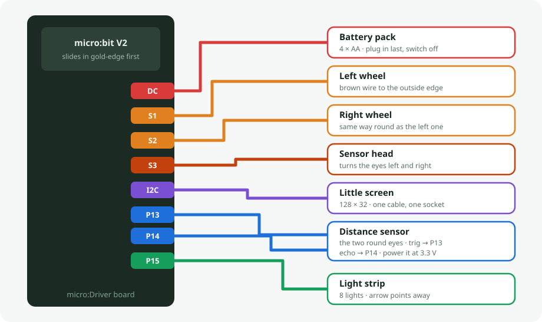
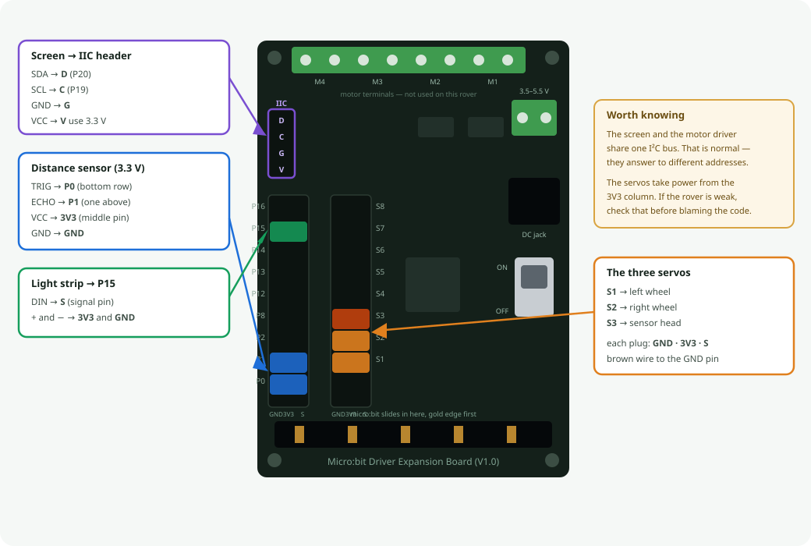

# 🤖 dfrobot-rover

A micro:bit rover that drives on two servo wheels, looks around with an
ultrasonic sensor on a third servo, and shows messages on a little screen.

You drive it from a web page over Bluetooth — nothing to install, no account,
no WiFi. Open [rxy_web](https://github.com/abourdim/rxy_web) in Chrome or Edge,
press **Connect**, and the rover's own control panel appears.

**The robot owns the layout.** The app is a plain renderer: it connects, asks
the rover what controls it has, and draws whatever comes back. There is nothing
to configure in the browser, and no special build of the app for this robot.

## Where everything plugs in



And where those sockets actually are on the board:



| part | plugs into | notes |
|---|---|---|
| micro:bit **V2** | the edge slot | V2 only — V1 hasn't enough memory for Bluetooth plus the screen |
| left wheel servo | **S1** | 360° continuous rotation; `90` means stop |
| right wheel servo | **S2** | mounted mirrored — see *Straight-line trim* below |
| little screen | **I²C port** | SSD1306 128×32 at address `0x3C` |
| distance sensor | **P0** trig · **P1** echo | HC-SR04**P**; take VCC from **3V3** |
| sensor head servo | **S3** | turns the eyes left and right |
| light strip | **P15** | 8 NeoPixels — **wired but not driven**, see *No light strip* below |
| battery pack | **DC socket** | 4×AA, 3.5–5.5 V |

Still free for whatever you add next: **P2 P12 P13 P14 P16**. P8 is spoken
for — see *the tone pin* below.

### Two things share one cable

The screen and the motor driver both live on the I²C port and don't argue —
the driver answers to `0x40`, the screen to `0x3C`. The wheels therefore cost
**no pins at all**; they're driven over that same cable.

### The tone pin

micro:bit drives **P0** whenever it plays a note — and P0 is the sonar trigger
here. Left alone, every beep would fire spurious pings. The firmware moves the
tone output to P8 at boot, before anything can sound; a V2 still beeps through
its built-in speaker, so nothing is lost. That is why P8 is not in the free
list.

### Servo power is worth a look

The servo headers on this board take their power from the **3V3** column. Two
360° servos driving a chassis on 3.3 V will be weak and stall easily —
they normally want 4.8–6 V. If the rover struggles to move, that is the first
thing to check, not the code. Feed the servos from the battery rail if the
board offers it.

## Programming it

Open **[makecode.microbit.org](https://makecode.microbit.org)** → *Extensions*,
and paste this URL into the search box:

```
https://github.com/DFRobot/pxt-motor
```

**Two** extensions are needed. Paste each URL in turn:

```
https://github.com/DFRobot/pxt-motor
https://github.com/tinkertanker/pxt-oled-ssd1306
```

| | appears as | provides |
|---|---|---|
| [DFRobot/pxt-motor](https://github.com/DFRobot/pxt-motor) | `motor` | `motor.servo()`, `motor.MotorRun()`, `motor.motorStop()` |
| [tinkertanker/pxt-oled-ssd1306](https://github.com/tinkertanker/pxt-oled-ssd1306) | `OLED` | `OLED.init()`, `OLED.clear()`, `OLED.writeString()` |

**Not** `pxt-neopixel`. It will not share this board with Bluetooth — see
*No light strip* below.

**Paste the URL — do not search by name.** DFRobot published this as plain
`motor`, the most generic name on the platform, so a search returns a pile of
look-alikes with this one somewhere among them. Pick the wrong one and it
**compiles cleanly and moves nothing**, which is a miserable thing to debug.

### And one that is not in the gallery

Wheel trim is stored in the micro:bit's own flash, which needs the **`settings`**
library. Searching *Extensions* for it finds **nothing** — it ships with the
editor but is marked hidden, so it has to be added by hand:

1. Open **Explorer** (bottom left of the editor)
2. Click **`pxt.json`**
3. Add one line to `dependencies`:

```json
"settings": "*"
```

It goes **last** in the list, so the line above it needs a comma added to its
end. Miss that and the failure is a JSON parse error that never mentions
`settings` at all.

`"*"` means the copy bundled with the editor, not a download. Without it every
`settings.` line fails with **Cannot find name 'settings'** — six errors, all
pointing at the trim code.

Adding *Data Logger* does **not** help: it depends on `flashlog`, not on
`settings`.

### Bluetooth project settings

These live behind the **gear icon → Project Settings**, and getting them wrong
looks like a broken app rather than a wrong setting — so set them before you
wonder why nothing connects.

| setting | set it to | why |
|---|---|---|
| **No Pairing Required** | **on** | The browser can then advertise-and-connect straight away. The other two modes — *JustWorks* (copy a pattern) and *Passkey* (verify a number) — make every child pair the micro:bit first, and after pairing you must reset it and re-enter pairing mode just to flash again. |
| **Bluetooth UART service** | **on** | This is the only service the rover uses. The whole protocol is lines of text over it. |
| accelerometer, button, LED, magnetometer, temperature, IO pin, event services | **off** | Each one costs memory and advertising space for nothing. The firmware never calls them. |

**Radio and Bluetooth cannot both exist.** Adding the Bluetooth extension
*removes* the radio package, and MakeCode asks you to accept that. It's a
hardware limitation, not a setting — so if a project uses `radio.sendNumber`
anywhere, it cannot also be a Bluetooth robot. This firmware uses no radio
blocks.

**Transmit power** is set in code (`bluetooth.setTransmitPower`), not in the
settings — the firmware turns it down while the layout is transferring, which
is the cheapest way to keep the link stable through a long burst.

One code rule worth repeating, because it cost real debugging: **never write to
the UART from inside the receive callback.** Sending a reply from within
`onUartDataReceived` starves the Bluetooth stack's buffers and wedges the whole
firmware. Every reply in this file is queued and sent from the main loop
instead.

### Then paste it

Switch to the JavaScript view, paste
[`firmware/rover-remote.ts`](firmware/rover-remote.ts), and download to the
micro:bit.

There is no local build step. MakeCode compiles in the browser, so **a fresh
paste is the build** — treat a successful paste as the thing that proves the
code, not a formality.

## Two traps worth knowing

**Straight-line trim.** The right servo is mounted facing the other way, so
"forward" is *down* from 90 on that side and *up* on the left. Trim is added on
the left and **subtracted** on the right, so a positive number means "more
forward" on both wheels. Add it to both and the rover curves. Two 360° servos
never run at matched speeds out of the box, so expect to trim every robot
individually — drive it forward on a flat floor and nudge whichever wheel is
lagging.

**No light strip.** The 8-pixel header on P15 is wired and the strip lights
up on its own, but nothing in the firmware drives it: `pxt-neopixel` will not
share this board with Bluetooth, and between a light strip and a robot you can
steer, the robot wins. Removed in **R1-v11**; the code that drove it is still
in git (`819020c`) if that ever changes.

**The 128×32 screen needs its start-up corrected.** The common MakeCode screen
libraries accept a height but hardcode the two registers that tell the display
how many rows it actually has. After `init`, send `0xA8, 0x1F` and
`0xDA, 0x02`, or text draws doubled and interlaced. It starts up without any
error, so there's nothing to chase — you just get a strange-looking screen.

## How the code is arranged

Everything specific to this board sits in one short seam at the top of
[`firmware/rover-remote.ts`](firmware/rover-remote.ts):

```
wheels(l, r)     drive mix → two servo pulses, with the mirror and the trim
wheelsStop()     both wheels to neutral
pingCm()         distance sensor on P0/P1; 500 means nothing came back
```

Everything below that seam is the shared rxy stack — Bluetooth, the chunked
layout transfer, the layout cache, telemetry, the drive watchdog, the D-pad
handling. Changing to a different driver board means rewriting those three
functions and nothing else.

### How the app and the robot talk

```
app   → robot   GETCFGVER          what layout do you have?
robot → app     CFGVER <id>        this one
        (match) → CFGOK            already cached, nothing to send
        (differ)→ GETCFG           send it all
app   → robot   SET <widget> <v>   a control moved
robot → app     UPD <widget> <v>   a reading changed
```

Because the layout is cached against that id, only the **first** connection
pays for the transfer.

## The five panels

The **Level** selector is on every panel, so you switch with a dropdown
instead of reflashing. Each is a separate layout stored on the robot and only
the chosen one is sent, so Beginner appears in under three seconds where
Expert takes about nine.

| panel | what's on it |
|---|---|
| **Beginner** | pad, STOP, distance, alert. Nothing else. |
| **Expert** *(the default)* | everything the rover can do |
| **Drive** | jog each wheel, watch which way it turns, trim it straight |
| **Distance** | gauge, alert, graph, and the sensor head |
| **Screen** | type a message, see it on the glass |


### Changing the Expert panel

Expert is **not** laid out in `gen_layout.py` any more. It was arranged in the
app's own **Build** screen and exported, because parts of it cannot be
expressed by that file's rules — STOP sits *inside* the D-pad's empty centre,
and each wheel reads as one control, `[−1] [slider] [+1]` with the number
underneath. The generator's overlap check would reject both, correctly.

To change it: open Build, rearrange, export, and drop the JSON over
`firmware/expert_from_builder.json`. Then run:

```bash
python gen_layout.py
```

It still refuses to build if a widget on that panel has no firmware handler,
if two share an id, or if the Level selector is missing — the checks that
decide whether the robot works. Only the geometry house-rules are skipped,
since a person placed those deliberately and has already seen them on screen.

The generator also strips everything the app reconstructs by itself — empty
`props`, `groupId`, and any value equal to its own default — which is why the
hand-tuned panel transfers in about **9.9 s** rather than the 14.4 s the raw
export would have taken.

## The sensor head

The ultrasonic sits on its own servo, so the rover can look around without
turning. **Look** aims it by hand, **Ahead** re-centres it, and setting
**Head** to **Sweep** pans it back and forth on its own, so the distance graph
draws the room instead of one fixed direction.

Sweep stops automatically in **Avoid** mode and the head returns to centre.
Avoid decides where to go from the distance *straight ahead*, so with the head
panning a wall beside the rover would read as an obstacle in front of it.

The sweep stops short of the ends, 30° to 150°. A head that slams into the
chassis stalls the servo, which buzzes and draws current instead of moving.

## What the screen shows

Four lines, 21 characters each — the panel is 128×32 and the font is 5×8, so
it holds more than the two-line banner it used to draw.

```
micro:bit gazug
Dist   -- cm
Trim L 0   R 0
Speed 200  Head  90
```

The top line is the one that earns its place: **`micro:bit gazug` is the name
the browser's chooser lists**. Every micro:bit in the room offers the same
"BBC micro:bit" prefix, so without it you are picking a robot at random.
Once connected that line becomes the firmware version and the drive mode.

Trim is there because it lives in the rover's own flash now — it is how you
check that the robot you just picked up is the one you calibrated, before
connecting to anything.

Type into **Say something** on the Screen panel and your message takes the top
two lines; trim and speed keep the bottom two.

**Why there is no clock on it.** Each character costs ten separate I²C
transactions, and the screen library offers no way to move the cursor — the
only way back to the top-left is to clear the whole panel. Every repaint is
therefore the full screen again, on the same bus as the servo driver. So the
screen is redrawn **only when the text actually differs**, and distance is
rounded to 5 cm so sensor jitter alone cannot trigger one. A parked rover
costs no I²C at all. A ticking second would have cost a full repaint every
second forever — the uptime clock stays in the app, where it is free.

## Driving straight

Two 360° servos never run at matched speeds, so a rover always curves a little
at first. Drive forward on a flat floor and raise whichever wheel is lagging.
Expect single digits — more than about 10 usually means something mechanical.

Each wheel has **three ways at the same number**, because getting a rover
straight is really three jobs:

| control | what it's for |
|---|---|
| **Trim L** / **Trim R** sliders | get close in one drag |
| **L − 1** / **L + 1**, **R − 1** / **R + 1** | the one that matters — "still pulls slightly left" is a *single* degree, and one degree of servo pulse is the floor |
| **L =** / **R =** fields | type an exact number back in |

They all drive the same value and the robot echoes back to all three, so they
can never disagree: nudge the button and the slider moves with it.

**The rover remembers it.** From **R1-v12** trim is written to the micro:bit's
own flash, so a trimmed robot stays trimmed through a battery change, a
reflash of the same program, and a move to a different tablet. Pick up any
rover from the shelf and it is already straight.

It is saved **two seconds after you stop adjusting**, not on every movement of
the slider — flash has a finite number of erase cycles, and a write per event
would spend the chip's life calibrating one robot.

This needs a micro:bit **V2**: the `settings` API is excluded from the V1
build. No loss here, since the rover already needs V2 for Bluetooth plus the
screen.

## Driving modes

| mode | what it does |
|---|---|
| **Manual** | you drive with the pad |
| **Avoid** | the rover drives itself and backs away from obstacles |

## Status

| | |
|---|---|
| drive, trim | working on hardware |
| trim stored on the robot | written — needs a flash to confirm on hardware |
| distance sensor, sweep head | working on hardware |
| screen | status display — written, untested on glass |
| five control panels | working on hardware |
| light strip | **removed in R1-v11** — clashes with Bluetooth |

## Planned

Three of these need no extra parts — a micro:bit V2 already has a speaker, a
microphone and a motion sensor.

- **A face on the screen** — two big eyes that blink, look worried as something
  gets close, go dizzy when spinning, and fall asleep when idle.
- **Ouch** — the motion sensor feels a bump, the rover flinches and backs off.
- **Reversing beeper**, like a truck, only when going backwards.
- **Clap to go** — one clap starts, two stops.
- **Follow my hand** — holds a fixed distance from whatever is in front of it.
- **Record & replay** — drive a path, play it back.
- **Light shows** — rainbow, chase, sparkle, Knight Rider. Blocked until the
  strip can share the board with Bluetooth; see *No light strip*.

Powered by [Workshop-DIY.org](https://workshop-diy.org)
